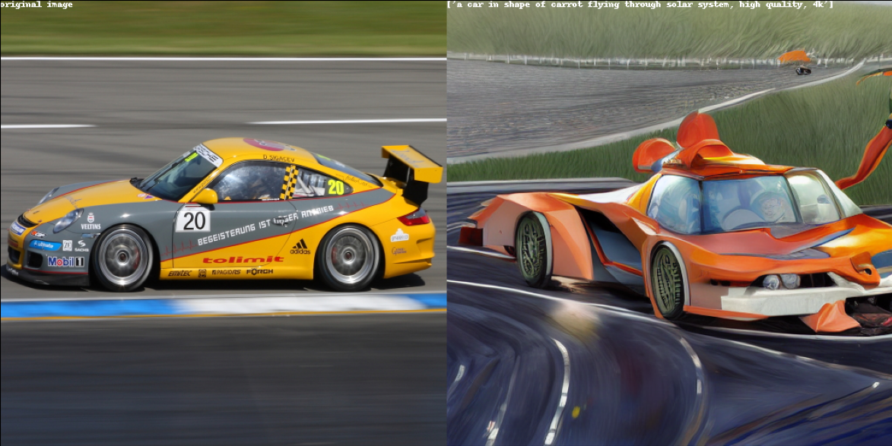
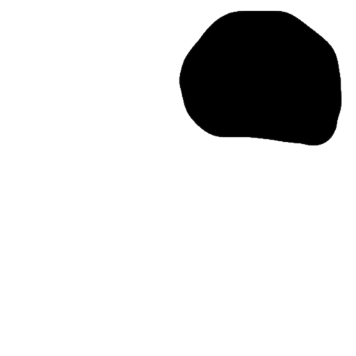
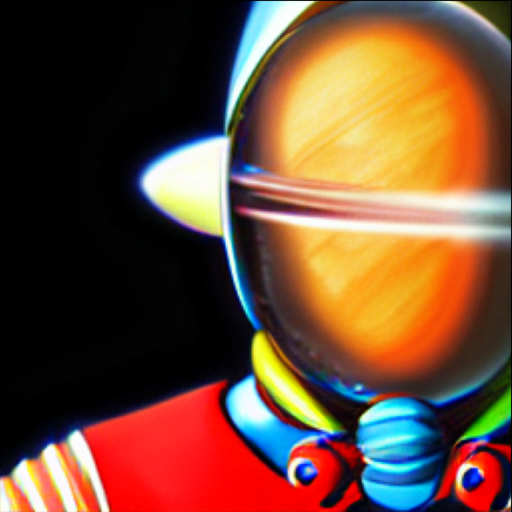
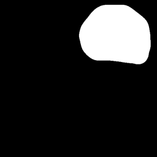

# distill-sd

Experiment with inference of pretrained ldm model and try distill knowledge to smaller network.

Initial poor buggy implementation with working text to image and image to image inference. Lower vram requirement than original repo. Try to process parts of model in cpu and rest in gpu if chosen to reduce vram (not properly tested yet). Negative prompt added not sure if works.

Training code removed. Training code from [this](https://github.com/runwayml/stable-diffusion) and [this](https://github.com/CompVis/stable-diffusion) repo should work. 


## Install

```
pip install -e .
```

## Demo

### Text to Image

> "a car in shape of carrot flying through solar system, high quality, 4k"


### Image to Image

Guided also by positive text and negative text prompt if provided.

> a car in shape of carrot flying through solar system, high quality, 4k



### Conditional Inpainting

> an astronaut floating in space, high quality, 4k



> moon planet in background, high quality, 4k




## Pretrained Models

Tested on SD 1.4, 1.5 and 1.5 inpainting model.

- https://huggingface.co/CompVis/stable-diffusion-v-1-4-original
- https://huggingface.co/runwayml/stable-diffusion-v1-5
- https://huggingface.co/runwayml/stable-diffusion-inpainting


## References
- https://github.com/runwayml/stable-diffusion
- https://github.com/quickgrid/vq-compress
- https://github.com/CompVis/stable-diffusion
- https://github.com/CompVis/latent-diffusion
- https://github.com/CompVis/taming-transformers
- https://github.com/basujindal/stable-diffusion
