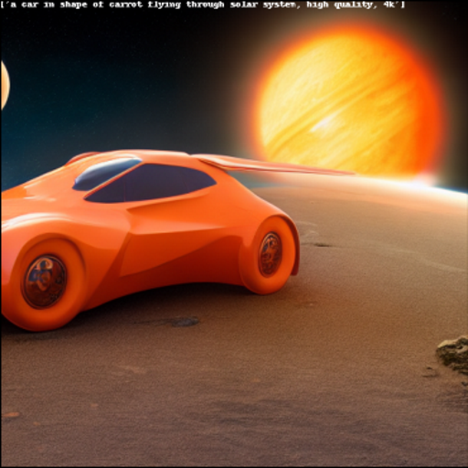

# distill-sd

Experiment with inference of pretrained ldm model and try distill knowledge to smaller network.

Initial poor buggy implementation with working text to image and image to image inference. Lower vram requirement than original repo. Try to process parts of model in cpu and rest in gpu if chosen to reduce vram (not properly tested yet). Negative prompt added not sure if works.

Training code removed. Training code from [this](https://github.com/runwayml/stable-diffusion) and [this](https://github.com/CompVis/stable-diffusion) repo should work. 


## Install

```
pip install -e .
```

## Demo

### Text to Image



### Image to Image


## References
- https://github.com/runwayml/stable-diffusion
- https://github.com/quickgrid/vq-compress
- https://github.com/CompVis/stable-diffusion
- https://github.com/CompVis/latent-diffusion
- https://github.com/CompVis/taming-transformers
- https://github.com/basujindal/stable-diffusion
